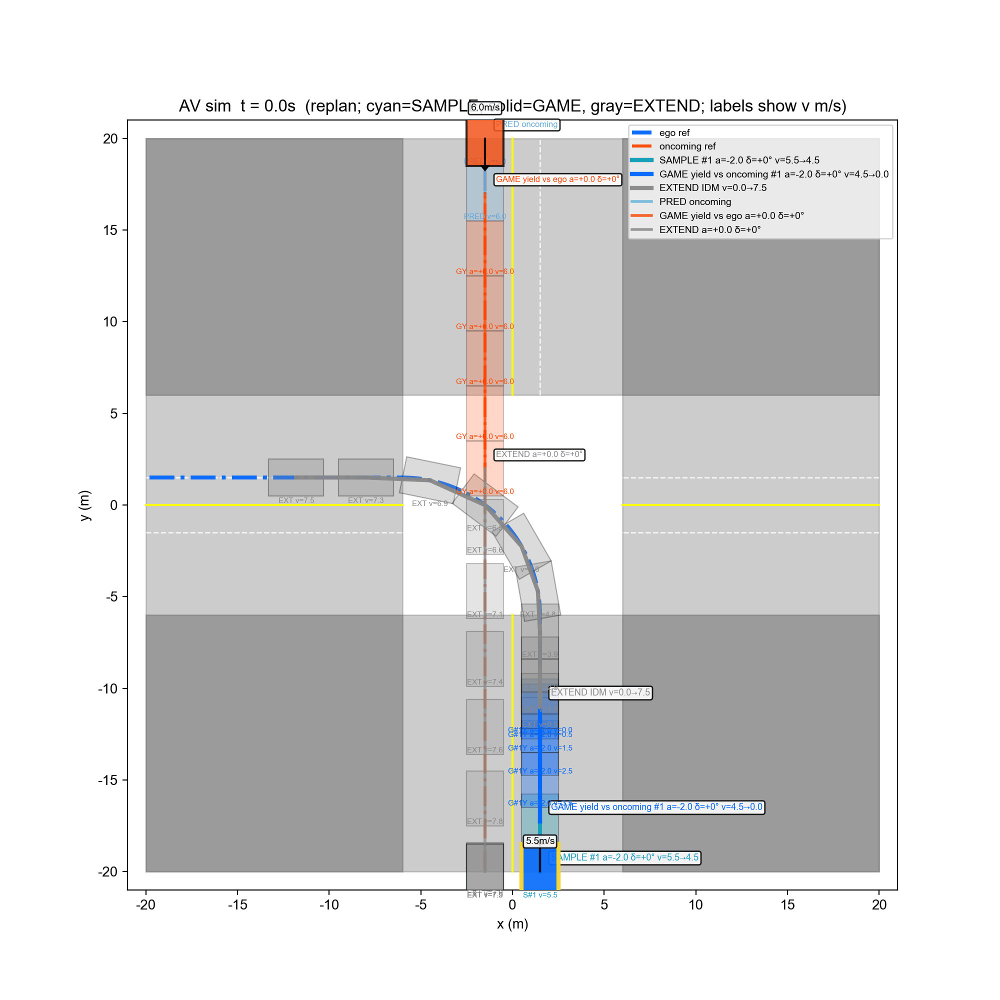
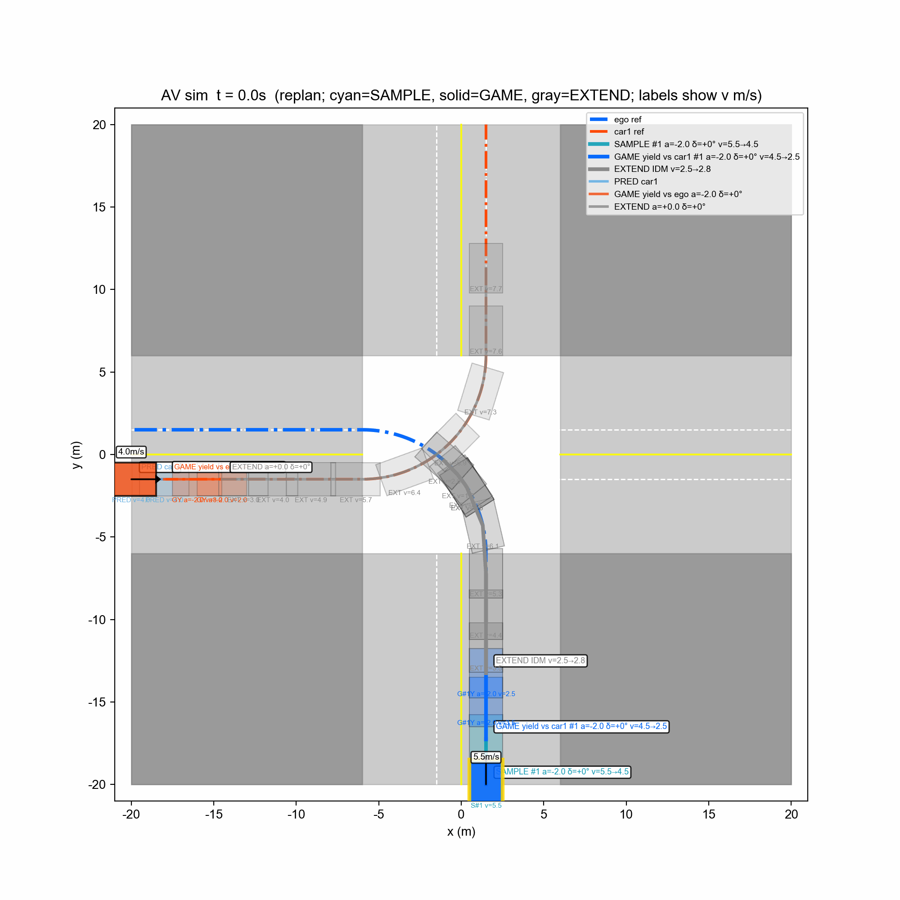
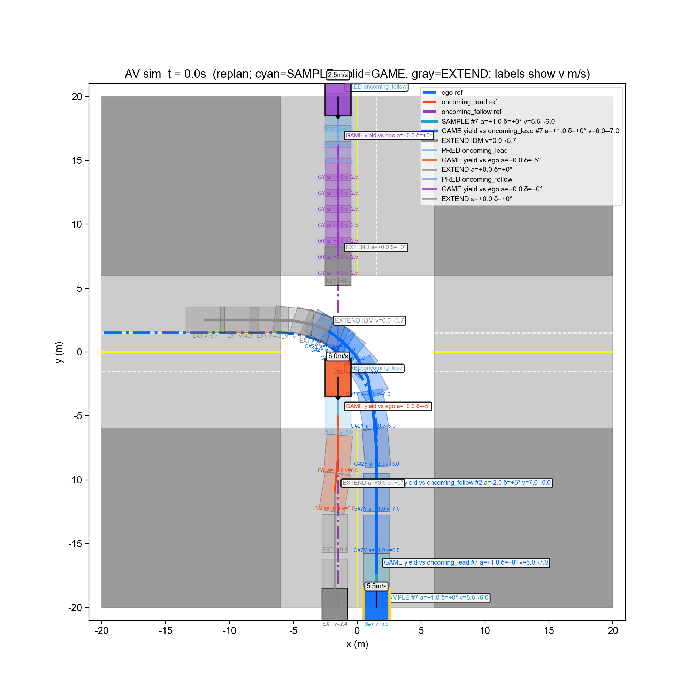
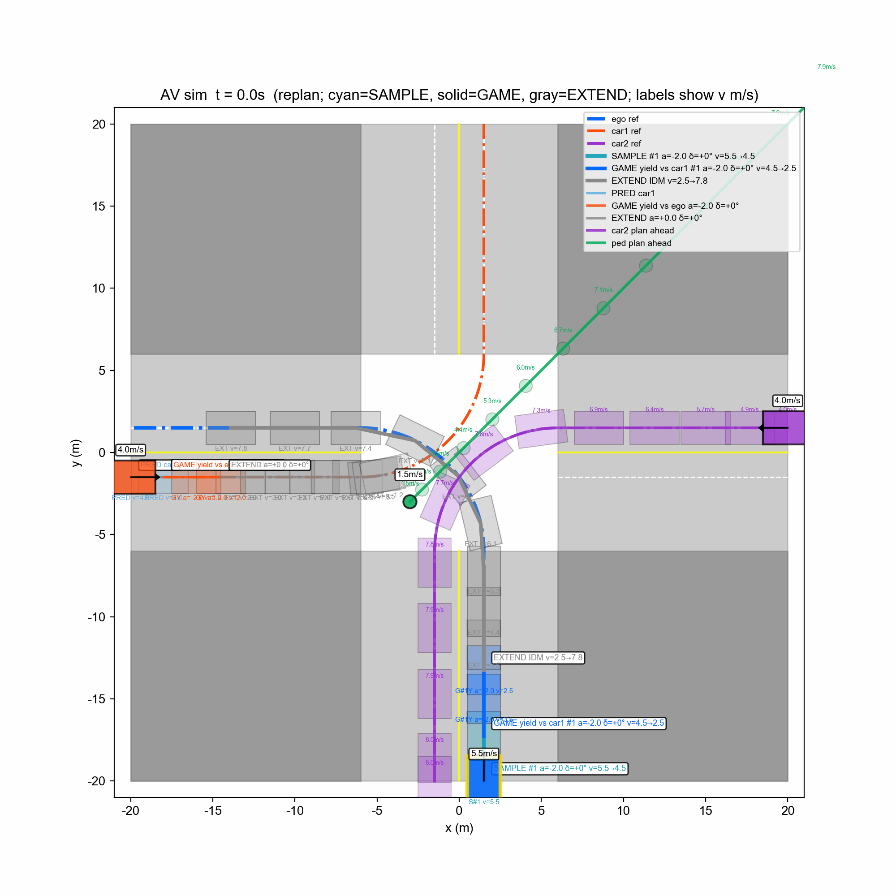

# interactive-planning-lab

Visual demos of interactive decision-making (MCTS) and trajectory optimization (iLQR) for autonomous driving.

This repo is a **showcase**, not a third copy of the algorithms — short GIFs, short tech cards, links to source.

---

## PairMCTS

Intersection **Level-1 game + MCTS** for unprotected left turns: ego negotiates yield / gap / continue against oncoming traffic (and sometimes pedestrians), then emits a coarse trajectory + semantic tags for downstream optimization.

Closed-loop demos below use **receding-horizon replanning** (re-run MCTS each sim step, ~20 s). In these sims, **obstacle vehicles drive at constant speed and do not play a game** — only ego runs PairMCTS; opponents are open-loop constant-velocity agents.

### Scenario 4 — unprotected left vs one oncoming straight



### Scenario 1 — unprotected left vs crossing left-turner



### Scenario 3 — unprotected left vs two oncoming straights (gap)



### Scenario 2 — three left-turners + pedestrian



### Tech card

| | |
|---|---|
| **Problem** | Unprotected left at intersection; multi-agent interaction |
| **Method** | Pairwise Level-1 games inside MCTS → Boltzmann cost → rollout → backprop; closed-loop replan |
| **Demo** | 20 s receding-horizon sims (scenarios 1–4) |
| **Output** | Semantic tags (yield / overtake / …) + coarse ego trajectory |
| **Limitations** | Python research demo; opponents are CV (no game); not production / Orin / real perception |
| **Source** | PairMCTS (formerly `ks_decision`) — public link TBD |

---

## Coming next

| Project | Status |
|---------|--------|
| **myiLQR** — DDP / iLQR trajectory optimization | Planned |
| **InteractMCTS** — lane-change vertical slice | Later |

---

## Layout

```text
interactive-planning-lab/
├── README.md
└── assets/pairmcts/
    ├── scenario_1_sim_20s_replan.gif
    ├── scenario_2_sim_20s_replan.gif
    ├── scenario_3_sim_20s_replan.gif
    └── scenario_4_sim_20s_replan.gif
```
